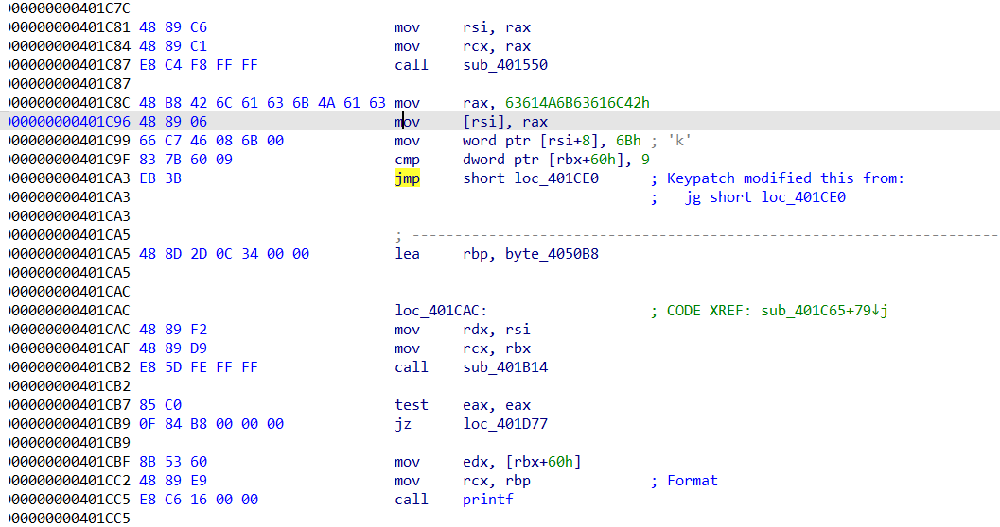
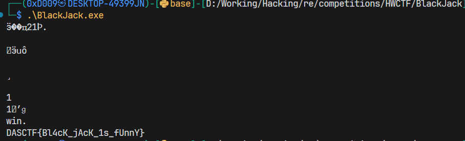
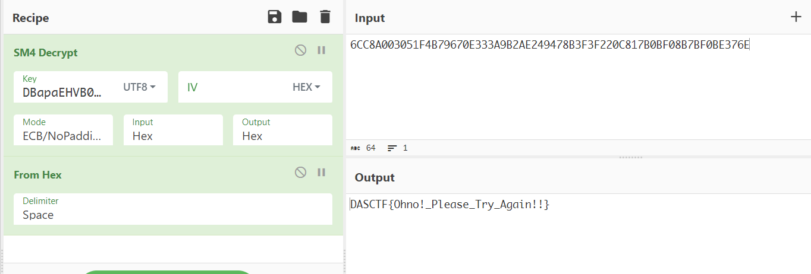

## 感想

属于比较简单的一次比赛，可惜对一些题型还不是很熟悉，没有拿到血。

初赛 240+ 进 40 ，没打过这么富裕的仗，不过题目区分度有点有限，最后 28 名，少做一道应该都进不了了。

## ezhtml

不是很熟悉 wasm 这一块，在题目目录下起个 `python -m http.server` 就能正常运行了，然后正常在浏览器下断点调试，静态分析的话，参考 https://github.com/WebAssembly/wabt ，直接用 web demo 就能转成 wat 文件，这题比较简单所以就不往 c 那边转了，main 函数调用 f7 函数，f7 函数处理输入，大概逻辑如下：
```python
cipher[i] = input[i] ^ (input[i+1] & 0xf)
```

这样就可以在知道第 k 位的情况下求出第 k+1 位的低四比特了，而高四比特则求诸下一个位密文，因为对低四比特的异或会保持高四比特。

然后结合第一位是 `D` 的猜测：
```python
cip = b'EBPGRM|VE9B]Q5Sb4vJ^2|ZoU[t?SiDf9Cx'
flag = b'D'

while len(flag) < len(cip):
    for c in range(16):
        if c ^ flag[-1] == cip[len(flag)-1]:
            c |= (cip[len(flag)] >> 4) << 4
            flag += bytes([c])
print(flag)

# b'DASCTF{WA4M_R3Ve7sE_1s_eZ_t0_lEa7N}'
```

## BlackJack

我们常常把这种人叫做——“土块”！

游戏逻辑纯纯多余，自己手算了几把不对，干脆打 patch 过掉游戏逻辑：


然后直接执行即可：


## downcity

虚拟机被隐藏了，不过找了一会没找到触发点，结合正常运行也没有触发虚拟机逻辑，怀疑根本就是出题人太睿智了，索性抄个 python 出来，这虚拟机写的非蠢即坏，几处函数名和实际操作对不上。

以下是我的脚本：
```python
import struct

code = '00000007......' # 此处省略

code = bytes.fromhex(code)
code = list(struct.unpack('<608I', code))

def vm_parse(n):
    res1 = n & 0xFF
    t = n & 0xFF
    if t == 6:
        res2 = n >> 8
    else:
        if res1 > 6:
            res2 = 0
        if t == 1:
            res2 = n >> 8
            return res1, res2
        if t == 5:
            res2 = n >> 8
        else:
            res2 = 0
    return res1, res2

stack = []
p = False

inp = b'DASCTF{h1Den_Vm_I3_Soo0_Fun_!}'
idx = 0

while 1:
    r1, r2 = vm_parse(code[code[0]+1])
    if p: print(r1, r2)
    if r1 == 1:
        stack.append(r2)
        if p:
            print(code[0], "push", r2)
        code[0] += 1
    elif r1 == 2:
        stack = stack[:-1]
        if p:
            print(code[0], "pop")
        code[0] += 1
    elif r1 == 3:
        stack[-2] += stack[-1]
        stack = stack[:-1]
        if p:
            print(code[0], "add")
        code[0] += 1
    elif r1 == 4:
        stack[-2] |= stack[-1]
        stack = stack[:-1]
        if p:
            print(code[0], "or")
        code[0] += 1
    elif r1 == 5:
        stack[-1] <<= r2
        if p:
            print(code[0], "lsh", r2)
        code[0] += 1
    elif r1 == 6:
        stack[-1] >>= r2
        if p:
            print(code[0], "rsh", r2)
        code[0] += 1
    elif r1 == 7:
        stack.append(inp[idx])
        idx += 1
        if p:
            print(code[0], "input", idx - 1)
        code[0] += 1
    elif r1 == 8:
        print(chr(stack[-1]), end='')
        stack = stack[:-1]
        if p:
            print(code[0], "print")
        code[0] += 1
    elif r1 == 9:
        if p:
            print(code[0], "jmp")
        code[0] = stack[-1]
        stack = stack[:-1]
    elif r1 == 10:
        if stack[-2] == stack[-3]:
            code[0] = stack[-1]
        else:
            code[0] += 1
        if p:
            print(code[0], "jne")
    elif r1 == 11:
        if stack[-2] >= stack[-3]:
            code[0] += 1
        else:
            code[0] = stack[-1]
        if p:
            print(code[0], "jle")
    elif r1 == 12:
        exit()
    else:
        print(code[0], "[unknow]")
    if p:
        print(stack)

```

打开 p 之后就可以看到比较清晰的虚拟机逻辑，可以逐位爆破，这里位数也不错，所以我当时选择了根据逻辑逐位手摇。


## Detou4

利用 TLS 函数 hook 了 `scanf` 和 `strcmp` ：
```cpp
int __stdcall TlsCallback_0_0(int a1, int a2, int a3)
{
  HANDLE CurrentThread; // eax
  HANDLE v4; // eax

  sub_31677();
  CurrentThread = GetCurrentThread();
  sub_3153C(CurrentThread);
  sub_31203((int)&off_4650C, &off_31596);
  sub_3150F();
  sub_31677();
  v4 = GetCurrentThread();
  sub_3153C(v4);
  sub_31203((int)&off_46510, sub_3131B);
  return sub_3150F();
}
```

没细看，好像在调试的时候不会触发，直接把 hook 给 patch 到原文件上就可以调了，伪装层是一个矩阵乘法加密的 key 和一个 SM4 ：
```python
import numpy as np

ans = [0] * 16
ans[0] = 29324
ans[1] = 23096
ans[2] = 30330
ans[3] = 27321
ans[4] = 27565
ans[5] = 21206
ans[6] = 28367
ans[7] = 26831
ans[8] = 21609
ans[9] = 16523
ans[10] = 22755
ans[11] = 19997
ans[12] = 31007
ans[13] = 24521
ans[14] = 30962
ans[15] = 31181

mat = b'X:YsG:D4NL>ecG{8'
mat = [mat[i] for i in range(16)]

m1 = np.array(ans, dtype=np.float32).reshape(4, 4)
m2 = np.array(mat, dtype=np.float32).reshape(4, 4)

im2 = np.linalg.inv(m2)
m3 = m1.dot(im2)

for i in range(4):
    for j in range(4):
        print(chr(int(m3[i][j] + 0.5)), end='')
print()

# DBapaEHVB03UcXlM
```



喜提 fake flag 。

`scanf` 被以下函数 hook：
```cpp
int __cdecl evil(char *Format, const char *a2)
{
  size_t v2; // eax
  int v4; // [esp+F4h] [ebp-8h]

  v4 = off_4650C(Format, a2);
  if ( j_strlen(a2) == 16 )
  {
    sub_31046();
    sub_3152D(dword_46944, a2);
  }
  else if ( j_strlen(a2) == 32 )
  {
    v2 = j_strlen(a2);
    j_memcpy(byte_46908, a2, v2);
    sub_314C9(dword_46944, byte_46908);
  }
  return v4;
}
```

我们第一次输入的时候会置乱 S 盒，扩展 AES 密钥，第二次则是 AES 加密，而且应该是做了魔改。

通过调试获得 S 盒并找到魔改的地方，参考 https://github.com/dhuertas/AES.git 修改一下逆 S 盒和逆行移位逻辑。

```cpp
// aes.c
static uint8_t inv_s_box[256] = {224, 184, 68, 45, 43, 49, 71, 170, 187, 69, 137, 26, 114, 38, 174, 53, 34, 103, 213, 211, 89, 250, 206, 180, 225, 204, 115, 147, 58, 197, 145, 101, 251, 128, 67, 222, 102, 144, 73, 236, 57, 3, 130, 195, 237, 59, 182, 212, 56, 201, 241, 106, 113, 139, 138, 31, 54, 12, 192, 232, 226, 156, 62, 84, 154, 191, 24, 60, 215, 41, 247, 64, 243, 33, 158, 252, 172, 202, 1, 92, 44, 61, 52, 83, 254, 234, 217, 220, 35, 239, 63, 37, 90, 209, 47, 21, 127, 15, 164, 159, 150, 79, 70, 140, 105, 163, 196, 253, 18, 109, 48, 50, 124, 98, 186, 131, 6, 27, 0, 80, 32, 19, 120, 116, 189, 129, 40, 231, 13, 133, 185, 86, 111, 87, 107, 205, 233, 203, 235, 125, 221, 119, 210, 39, 228, 244, 42, 122, 96, 121, 175, 161, 94, 78, 25, 4, 149, 91, 216, 110, 153, 108, 51, 242, 123, 16, 165, 23, 66, 99, 168, 179, 136, 100, 36, 126, 214, 193, 238, 199, 29, 75, 188, 134, 223, 22, 249, 5, 181, 82, 171, 219, 72, 17, 183, 117, 160, 148, 230, 104, 152, 28, 10, 142, 173, 176, 245, 46, 8, 118, 177, 162, 77, 166, 7, 55, 208, 132, 2, 218, 9, 229, 88, 85, 74, 155, 246, 76, 112, 200, 151, 146, 30, 207, 95, 240, 20, 14, 198, 135, 81, 255, 97, 194, 178, 141, 167, 143, 248, 227, 169, 190, 11, 65, 93, 157};// f

void inv_shift_rows(uint8_t *a1) {

	uint8_t v1, v2, v3, v4;
	
	v1 = a1[15];
	a1[15] = a1[14];
	a1[14] = a1[13];
	a1[13] = a1[12];
	a1[12] = v1;
	v2 = a1[10];
	a1[10] = a1[8];
	a1[8] = v2;
	v3 = a1[11];
	a1[11] = a1[9];
	a1[9] = v3;
	v4 = a1[5];
	a1[5] = a1[6];
	a1[6] = a1[7];
	a1[7] = a1[4];
	a1[4] = v4;
}
```

`strcmp` 被 hook 到与其他串比较，直接提出来，然后解密 AES ：
```cpp
#include <stdio.h>
#include "aes.h"

int main() {
	
	/* 256 bit key */
	uint8_t key[] = "DBapaEHVB03UcXlM";

	uint8_t in[] = {
		0x1f,0xc1,0xf4,0xbe,0xb7,0x14,0x75,0x1d,0xf9,0x17,0x19,0xca,0xc3,0x72,0x89,0xd4,
		0xbd,0xc3,0x8f,0x5f,0xeb,0x17,0xa1,0x2e,0x49,0x93,0x32,0x28,0x61,0x05,0xc0,0xa3};
	
	uint8_t out[33]; // 128

	uint8_t *w; // expanded key

	w = aes_init(sizeof(key));

	aes_key_expansion(key, w);

	aes_inv_cipher(in /* in */, out /* out */, w /* expanded key */);
	aes_inv_cipher(in + 16 /* in */, out + 16 /* out */, w /* expanded key */);
	out[32] = 0;

	printf("%s", out);

	free(w);

	return 0;
}

// DASCTF{D3t0urs_HoOk_Functions!!}
```

看这个 flag 的话，可以知道具体是怎么 hook 的，参考https://github.com/Microsoft/Detours/wiki/Using-Detours ，有空我也来学习一下。