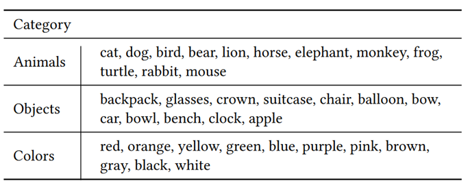
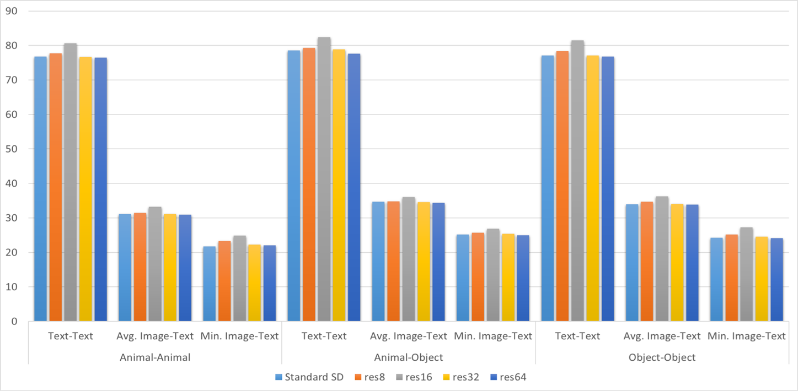

## 0x0 写在前面
本工作由包括本人在内的五名USTC网安专业同学完成，是专业选修课程《机器学习及其安全应用》的大作业，有些工作涉及到其他人会写明。在修读本课程之前，我们五个对机器学习的平均了解程度尚在只知道线性回归的程度，所以文中有不合理的地方请大家见谅。

由于本工作论创新性是不够的，而且我们五个人中很少有人会再做相关的工作了，所以选择在博客上分享，想要比较流畅地阅读本文还需要一些关于隐空间扩散模型的先验知识，由于关于此的资料网上很多，我们不赘述。

我们组内分工相对合理，每个人都有不小的参与度，笔者是 leader 和第一贡献者，还有其他四位同学，为保证隐私，本文以惯用 ID 称呼他们：brealid、crabtux、albedo、WuY。

## 0x1 背景
近年来，扩散模型在目标文本提示（prompt）的引导下生成多样化和富有创造力的图像的能力已经被不少学术工作和工业界成果证明，如 Stable Diffusion 等。然而不难发现，现有的文生图扩散模型在推理中面临两个重要问题：
1. 灾难性忽视：模型没有忠实地根据文本提示生成其中的一个或者多个主体
2. 属性绑定错误：模型无法将主体的属性（如颜色）正确地绑定在相应的主体上

如下图所示：


此图上半部分是标准的 Stable Diffusion 模型（后文称 SSD ）在两个示例 prompt 下的生图效果，分别出现了灾难性忽视问题的属性绑定错误问题；而此图的下半部分是在 SSD 上应用接下来我们要讲的这篇工作后的生图效果，我们会稍细一点地说这篇工作，因为我们的探究任务就是针对它的。

### 简介
为解决或者说缓解上述两个问题，Attend-and-Exicite[^1]提出了一种免训练的方法，该文作者认为，交叉注意力表征的是图像中的一块区域（patch）与 prompt 中词元（token）的概率分布，即某块 patch 与某个 token 之间的交叉注意力高，则这个 token 所代表的语义出现在这一 patch 上的可能性也更高。

基于这一观点，AnE （即 Attend-and-Exicite ）通过在扩散模型推理过程中施加外力强行抬高图像中具有主体性质的 token （后文称 subject token）的交叉注意力来达到缓解灾难性忽视问题的目的，与此同时，作者也认为，属性绑定错误也和 subject token 的注意力较低相关——如果交叉注意力过低，则模型无法将 patch 和 token 联系起来，也就难以将 token 上的属性绑定在 patch 上。在尝试提高注意力之后，这一问题也得到了缓解，从实验上印证了作者观点的正确性。

由于本工作中涉及的注意力都是交叉注意力，所以接下来所有不加修饰的`注意力`指的都是交叉注意力，而不是自注意力。

### 优化过程


具体的优化算法可以由上图所示的算法给出。

1. 对于去噪过程中 timestep $t$ 的隐变量 $z_t$ ，AnE 首先提取得到它的注意力图 $A_t$ ，$A_{t} \in R^{res \times res \times n}$ ，其中 $res$ 是注意力的粒度，$n$ 是 prompt 中 token 的数量；
2. 本文作者注意到 SSD 中特殊 token \<sot\> (start of the text) 总是有很高的注意力，因此将其剔除之后再对注意力做其他 token 间的 softmax 进行归一化；
3. 对于 prompt 中的每一个 subject token ，获取它的注意力，做一次高斯平滑，然后取出注意力图中注意力最大的一个点 $max(A_{t}^{s})$，将$1-max(A_{t}^{s})$作为一个备选的优化目标函数；
4. 从所有备选的目标函数或者说损失函数中选择最大的那个作为最终的优化目标，从它开始反向传播，乘上系数 $\alpha_{t}$ 做梯度下降，去优化隐变量 $z_{t}$ ；
5. 做一个检查，如果目前的 timestep $t$  属于迭代优化（iterative refinement）的目标 timestep，而且目前损失函数还没有达到相应的阈值 $1-T_{k}$ ，那么从再从第一步开始
6. 最后拿优化好的隐变量 $z_{t}'$ 继续做推理去噪。

简单总结下，虽然 AnE 是一个免训练的方法，但是它优化注意力的方法依然是类训练的，它的优化目标是提高所有 subject token 的注意力图中的最高点的最小者（有点绕）。

这种对单点的优化是不合理的，作者也发现注意力值实际上不能直接准确地反映图像中是否生成了指定的主体，高注意力的小 patch 可能只会反映 token 的部分特征，比如说轮廓，所以作者还做了高斯平滑，这样一来，每一块 patch 都是它周围的 patch 的线性组合，笔者认为这就是把这种单点的优化扩散到周围去了，使其不至于出现陡变的高值，导致模型无法理解或者说分布失调。

值得注意的是，无论当前 timestep 下目标函数的值如何，即使已经达到阈值，AnE 也会先做一次保底的优化，但并非每个 timestep 都有优化，事实上，作者认为在去噪后期，图像的布局已经基本确定，再做优化效率很低，影响也不大，还可能使隐变量偏离原有的分布，所以优化只在前 25 个 timestep 进行（总共 50 个）。

从代码实现上看，迭代优化也受到一个次数阈值限制，一旦迭代次数超过这个限制就不再继续了，同样是为了防止分布失调，另外还有一点，注意到每一次优化都会进行一次去噪操作，所以如果假设去噪时间是单位时间，则 AnE 生成一张图片所需要的时间相比 SSD 至少多了 50 % ，如果不停迭代优化，效率更会大大下降，所以设计迭代次数阈值应该也有这方面的考虑。

### 实验方法
AnE 这篇工作中，通过定性和定量实验比较了自身和其他工作之间的差异，其中定性上就是从对灾难性忽视问题的缓解程度的视角出发去比较模型生成图片的差异，如本文第一张图片所示。

定性的实验，作者选用了两个指标来衡量，其一是图文相似度，由 CLIP 模型给出 prompt 和相应图像的相似度，我们后文也会称 CLIP Score，除了图片与整个 prompt 的相似度，为了更好地与忽视现象关联，也会单独取其中相似度较小的一部分的相似度用于比较；其二是文文相似度，由 BLIP 模型为图像生成描述（caption），再由 CLIP 模型给出 caption 和 prompt 的相似度，我们后文也会称 BLIP Score。

实验中所用到的 prompt 来自如下的主体和属性：


基于如下的三种形式：
1. a \[animalA\] and a \[animalB\] (Animal-Animal)
2. a \[animal] and a \[color\]\[object\] (Animal-Object)
3. a \[colorA\]\[objectA\] and a \[colorB\]\[objectB\] (Object-Object)

各类 prompt 对主体都是全排列，对于颜色则是随机选取，总的来说共组成了 276 种 prompt ，对其中的每个 prompt 取 64 个随机种子生成图片，最后利用这些图片去计算指标。

最后 AnE 得到的结果如下，图文相似度：


文文相似度：


本文就只关注 AnE 和 SSD 的差异。可以看到 AnE 确实带来了不小的提升，尤其是在 Min. Object Similarity 上，提升达到了 10% 左右，其他指标也有 4-5% 的提升。

除此之外，作者还对用户做了上述这几篇工作生图的偏好问卷调查，得到了能很好支撑 AnE 效果的评价。

## 0x2 目的
根据课程要求，我们需要完成的工作至少有三项：
1. 复现基于注意力机制的文生图扩散模型语义引导（AnE）
2. 探索分析使用不同粒度(16,32,64)的注意力图进行语义引导的效果，并与论文中的结果进行对比
3. 探索分析在推理阶段的不同 timestep 执行语义引导的效果

第一个工作不多赘述，关于第二个工作，可以来回顾一下 Stable Diffusion 的结构：


它将 512 × 512 × 3 的图片编码进 64 × 64 × 4 的隐空间，进行 50 步去噪，每步去噪由 UNet 进行，UNet 是一种网络架构，它先将图像下采样到低维，再上采样到高维，这过程种涉及到三次降维和升维，分别是 64 到 32 、32 到 16 、16 到 8 ，以及反过来相应的升维，注意力的粒度也和这个过程对应，实际存在 8，16，32，64 四种，所以除了尝试课程要求的 16，32，64，我们也尝试了 8 粒度的注意力。AnE 默认使用的注意力粒度是 16 。

第三个工作，和 AnE 中的迭代优化相关，上文已经提到迭代优化的过程，在实际的代码实现中，它由一个 `thresholds` 变量表征，默认为 `{0:0.05, 10:0.5, 20:0,8}`，含义是在 timestep 0 后，将注意力提高到至少 0.05，在 timestep 10 后，将注意力提高到至少 0.5，在 timestep 20 后，将注意力提高到至少 0.8，我们将尝试各种不同的 `thresholds` 来比较效果。

除了上述的三个工作，我们在探究过程中也遇到了一些其他值得思考的问题，所以一并探究了，这些探究将在接下来我们具体工作的总结与讨论中体现出来，这能一定程度上体现我们的思考过程。

此外，我们并不知道我们这种探究性质的工作相比那些应用型的创新在人工智能领域是否是有意义的，只是怀着热忱或者对课程应有的态度去完成这一工作。

## 0x3 过程——探究不同粒度注意力下语义引导的效果

### 复现效果
首先，一下是我们复现的 SSD 和 AnE 的定量实验：


大致上与原文一致，差异很小，故不作讨论了。

### 相似度比较
我们直接修改用于注意力引导的注意力粒度参数为 8、32、64，并进行了定量实验。

不区分 prompt 类别，从总体上来看，三个指标基本都呈现出 16 > 8 > 32 > SSD > 64 的态势。


而根据 prompt 分类的结果如下：


基本上和总体一致，并没有什么分类讨论的价值，所以我们后面不再比较分类的指标，数据维度太多会影响可读性。

从定性上看，我们选取下面两个 prompt 和随机种子作为例子：
a bear and a elephant: 1326


a dog and a red apple: 314


从左至右依次是 SSD 8 16 32 64，这也能体现出 16 > 8 > 32 > SSD > 64 。具体地，可以看到 SSD 会出现明显的灾难性忽视，在经过 16 粒度下注意力的引导之后得到了明显的缓解，8 粒度下有时也能体现出一些效果，但效果没那么好，32 和 64 粒度下就几乎于事无补了，甚至有时还会导致图片崩坏。


### 引导率比较
得到了这样的结论之后，我们需要探究它背后的原因，前文提到 AnE 对推理过程的效率影响是较大的，结合实验中 32 粒度和 64 粒度下生图的市场明显长于 16 粒度这一特征，我们设计了两个新的衡量指标用于定量实验：
1. 引导率：在 `thresholds` 中指定的 timestep 中，注意力未能达到阈值，因此而需要引导的概率
2. 引导成功率：经过迭代优化后，注意力最终能达到阈值的概率

这两个指标一方面直接反映了引导的效率，也可能会间接地反映引导的质量。这出于我们的以下想法：
1. SSD 生图中即使存在灾难性忽视，也是少数情况下，引导率太高是不合理的，对没必要引导的推理过程频繁做引导，可能导致分布失调，也影响效率
2. 如果迭代优化最终没有成功，至少说明优化已经跑满了迭代次数阈值，已经造成了对效率的极大影响，在一个 timestep 下过多的更新也可能导致分布失调
3. 如果迭代优化最终没有成功，也说明注意力没有达到预设的阈值，与 AnE 的原理相悖，我们猜想这可能导致了 32 粒度和 64 粒度下的引导效果不好

我们记录了不同粒度下的引导率和引导成功率，结果如下：


首先看 16 粒度下，引导率低，引导成功率高，完全是理想状态，8 粒度下其次，引导率在 timestep 0 时出现了异常高，引导成功率相比 16 粒度也是有不小的差距的，而 32 粒度和 64 粒度下的引导率都很高，在三成左右，64 粒度下的引导成功率比 32 粒度下更低。

这一方面部分印证了我们的猜想—— 32 粒度和 64 粒度下，引导确实不能很好地使注意力达到指定的阈值，这之间有一定相关性。

另一方面也启发我们去更好地设计合理的阈值，注意力达不到阈值，可能是粒度的问题，也可能是阈值的问题，换言之，以 16 粒度的阈值去要求其他粒度，不能说是合理的。

这也催生了接下来两个猜想：
1. 注意力粒度间的引导效果差异和扩散模型本身的性质关系更大
2. 注意力粒度间的引导效果差异和 AnE 中使用的包括阈值的众多参数的关系更大

由此我们团队兵分两路做接下来的工作，由 brealid 做实验验证第一个猜想，由 albedo 和 crabtux 做实验验证第二个猜想，笔者两边都有参与。


## 0x4 过程——从扩散模型角度的探究
在这部分工作中，我们从 SSD 本身去考虑，寻找不同注意力粒度下引导效果有差异的原因。

### 注意力图比较
首先，我们直接导出不同粒度的注意力图进行定性分析，选取 prompt 为 “an elephant with a crown”，种子为 21 时  SSD 生成的图像，左边反映图像与 token “elephant” 的交叉注意力，右边反映图像与 token “crown” 的交叉注意力，向上至下依次是 8 16 32 64 粒度：


可以看到，注意力在低粒度下更聚合，更容易出现高值，注意力图和图片布局的匹配度也高，而在高粒度下更分散，更不容易出现高值。

也就是说，我们可能因此在高粒度下很难去提高注意力的数值。

### 注意力变化趋势比较
接下来，我们导出了 SSD 生成图像的过程中较高注意力的 subject token 和较低注意力的 subject token 的 0.05 0.1 0.3 0.5 分位点的变化趋势如下：


32 粒度和 64 粒度之间各有相似的地方，整体趋势都大致相同，最高值和最高值出现的 timestep 也接近，大约在 (20, 0.25) ，这一方面印证了注意力图比较中定性分析的结果，另一方面说明 16 粒度下的阈值对它们来说是要求过高的。

8 粒度和 16 粒度下的最高值也接近，但是我们注意到 16 粒度下的高注意力 token 在 timestep 0 时就能有一个很高的注意力了，下 0.05 分位点接近 0.8 ，中位数达到 1 ，而低注意力 token 的下 0.05 分位点已经很接近 0 了，中位数也只在 0.6 左右，随着去噪的进行，粒度 16 下的注意力还在不停下降，而且下降速度不慢，到 timestep 20 的时候，连高注意力 token 中都有不少注意力跌下了 0.5 ，从单调性的角度来看，16 粒度下确实更需要引导来抬升注意力。

另外，在 8 粒度下，注意力在 timestep 10 前出现了一次大抬升，此后只缓慢下降，这趋势与 16 粒度差异较大，而在 timestep 0 时，8 粒度下的 token 注意力基本上集中在 0 附近，这就解释了 8 粒度下引导率为什么异常偏高。

总的来说，这些变化趋势解释了前面的一些实验结果，也一定程度上支撑了“注意力粒度间的引导效果差异和扩散模型本身的性质关系更大”的猜想。

我们继续看引入 AnE 之后，16 粒度下被引导的注意力曲线变化如何：


造成的效果非常明显，尤其是三次迭代优化，把两个 subject token 的注意力聚拢起来了——即它们的注意力差异变小了，而且是通过抬高低值的方式。

而在 32 粒度下引导的注意力曲线变化是：


低注意力 token 的注意力也提高了，但是高注意力 token 提高的也不少，最后没有达到像 16 粒度那样的聚拢效果，所以它效果差，而且，这里 subject token 的注意力的高值已经远远高过了 SSD ，这可能带来分布失调。

我们进行全局的比较，在 16 粒度下做引导，影响可以传递到 8 粒度中去，也可能导致了一次 64 粒度下的反常下降：


在 32 粒度下则不会出现这种影响的扩散：


### 总结
我们的实验是有助于验证“注意力粒度间的引导效果差异和扩散模型本身的性质关系更大”的猜想的。

我们看到了 16 粒度的一些特殊性，尤其是前文没有提到的，在 16 粒度下引导，不用担心高注意力 token 的注意力也像 32 粒度下那样出现过多的抬升，因为 16 粒度下的高注意力 token 的注意力是很接近 1 的，已经到达了上界，8 粒度下也有类似的特征，这可能是 8 粒度和 16 粒度下引导效果更好的原因。

值得一提的是，AnE 原文中提到另一篇工作 Prompt-to-Prompt[^2] （以下简称 ptp ），称 ptp 中已经展示了，16 粒度下的注意力图中含有最丰富的语义信息，但是根据笔者对该论文多个版本的仔细研读，并没有发现任何提到 16 粒度下注意力更好的语段，向后地，笔者也找到了[^3]和[^4] 两篇工作，都于 2024 年年初发布在 ArXiv 上，同样致力于缓解灾难性忽视问题，同样在 16 粒度下做了注意力的引导，但是也没有提到为什么 16 粒度好。

所以虽然我们有了一些证据，但是依然不能完全排除其他引导过程中参数的影响。

## 0x5 过程——从引导过程的角度探究
在这部分工作中，我们从 AnE 的引导过程去考虑，寻找不同注意力粒度下引导效果有差异的原因。

### 优化系数的影响
注意到 AnE 的优化算法中的 $\alpha_{t}$ ，它的作用和机器学习中的学习率很相似，在代码实现中。它是这样构成的：
```python
step_size=scale_factor * np.sqrt(scale_range[i])
```

接下来的实验，从 `scale_factor` 和 `scale_range` ，包括 `sqrt()` 代表的 `scale_function` 去考虑。

首先直观地看 `scale_factor` 的影响：


`scale_factor` 过高时，生成的图片质量变低了，这就是前文所提到的分布失调的影响，而过低时，由于高粒度下引导的效率低，引导成功率可能会因此下降，直接导致效率低，间接导致质量低。

在接下来的定量实验中，我们根据前面 SSD 中 32 粒度下的注意力变化趋势选择了相对合理的阈值，来防止引导率成功率过低带来的影响，除了引导率和引导成功率之外，我们还给出了平均引导轮次，即迭代次数：


可以看到随着`scale_factor` 的提高，引导率下降，引导成功率上升，平均引导轮数变少，然而不幸的是，图文相似度也出现了下降。


也就是说我们没有找到一个关于 `scale_factor` 的合适的平衡点，效率和质量之间存在冲突，默认取值 20 已经是一个表现不错的值了，修改 `scale_factor` 不是出路，最终效果依然以 16 粒度下相去甚远。

接下来我们从 `scale_function` 和 `scale_range` 来探究，根据注意力变化特征，我们想到：相比固定的 `scale_factor` ，`scale_function` 更能适配注意力变化，引导在不同的 timestep 可能有不同的需求，所以，我们选用了如下几种新的函数和它们的不同段：


相比 `sqrt()` 函数，它们是凹函数，即越到后面的 timestep ，引导的强度越高，最后我们得到的定量结果是：


结果上，都不如默认取值，最接近默认取值的组合即为最曲率最低的，即凹的程度最低的函数段，因此可以认为，还是凸函数效果更好，即引导越到后期强度应该越小，修改 `scale_function` 也不是出路，最终效果依然以 16 粒度下相去甚远。


### 高斯滤波器的影响
前文中提到高斯平滑，也叫高斯滤波器，高斯滤波器存在卷积核，它表征平滑在多大的范围内做平均，默认为 3 × 3 ，我们猜想，在高粒度下，应该扩大卷积核，使引导的效果扩散到更广的区域，但是与之相应的，卷积核扩大也可能使注意力分散到更广的区域，使注意力提高的效率变低。

因此，我们做了实验，同样以引导率、引导成功率、平均引导轮次来看效率：


从结果上来看，效率的变化非常小，可以忽略，而质量的变化更小：


但是从定性上看，卷积核的扩大确实带来了一些变化，以下是64粒度下 prompt "a cat and a dog"的生图效果：


一方面，卷积核较大时，起确实起到了扩大影响范围，上方的图中，出现了疑似“dog”的主体，另一方面，也会引起像下方图这样的图片崩坏——注意看猫的前爪。

两方面功过相抵，最终在定量上变化不大。

### 总结
总的来说，我们的实验基本上排除了引导过程中其他参数的影响，可以认为“注意力粒度间的引导效果差异和扩散模型本身的性质关系更大”。


## 0x6 过程——探究不同timestep下语义引导的效果
这部分由 WuY 主力完成，笔者也参与了相似度分析和定性分析。

### 引导率比较
我们尝试在 16 粒度的实验中修改 thresholds 的 timesteps 以优化引导的效果，在原论文的实现中，timesteps 设置为 `{0:0.05, 10:0.5, 20,0.8}`，对原实验分析得到的结果如下：

| 平均引导轮数 | 引导率   | 引导成功率 |
| ------ | ----- | ----- |
| 0.119  | 0.039 | 0.958 |

首先我们考虑的是修改不同 timesteps 引导的阈值 thresholds ，通过比较修改阈值后的引导率以及引导成功率来评测引导的效果。

尝试在第 0 步和第 10 步时将引导的阈值 threshold 设为 0 ，探究在早期进行逐步引导的作用：


可以注意到将第 0 步 threshold 设为 0 后，之后 threshold 0.5 和 threshold 0.8 的引导成功率有了明显的下降，将第 10 步 threshold 设为 0 后， threshold 0.8 的引导成功率也有所下降。这一现象说明如果在前期完全不加以引导，会使之后轮次的引导成功率下降，这也证明了前期加以少量引导的必要性。

之后我们尝试在不同的轮次上加以强引导（threshold 0.8）：


如果在前期就加以比较强的引导，如在第 0 轮就加以 threshold 0.8 的引导，虽然引导成功率也能达到约 93.1% 与原实验 95.8% 相差不大，但引导率达到了近22.7%，远超原实验的 3.9% ，这说明在前期就设置比较高的阈值会导致需要对图片做更多的引导，严重影响了模型的效率。如果在中期（第 10 轮）加以引导，引导率有明显下降（3.1%），但引导成功率也会有所下降（90%）。而如果在后期加以引导，引导率同样有明显下降（1.9%），而引导成功率变化不大（93.8%），因此将强引导放在后期进行是一个比较好的思路。

接下来尝试提高前期引导的阈值（第 0 轮阈值从 0.05 提高到 0.2）：

| thresholds                   | 平均引导轮数 | 引导率   | 引导成功率 |
| ---------------------------- | ------ | ----- | ----- |
| **{0:0.05, 10:0.5, 20,0.8}** | 0.119  | 0.039 | 0.958 |
| **{0:0.2, 10:0.5, 20,0.8}**  | 0.248  | 0.082 | 0.959 |

结果引导成功率几乎不变，而引导率有所提高，效率变低。因此在前期应当设置较小的阈值进行弱引导即可。

我们也尝试细分 timesteps ，即增加引导的频率来尝试优化引导的效果：


可以看到，当我们尝试增加引导的频率，在不同轮次加以不同 threshold 引导，不仅引导成功率有所上升，整体的引导率也有所下降，成功实现了在引导率和引导成功率上的优化。但这也并不代表引导的频率越高越好，因为我们设置了更多的阈值，虽然引导率也有所下降，但总共引导的次数反而会有所上升，因此一个理想的阈值设置要在引导频率和成功率上做一个权衡。

### 相似度比较
我们使用两种相似度指标来衡量图片与prompt的相似度。

从结果上来说，不同 Timestep 在生成图片的相似度上是非常相近的（即使是全 0 不做任何引导），这令我们有些意外。

但是能注意到早期就将注意力抬高的还是有优势的，例如 `{0:0.2, 10:0.5, 20:0.8}` 和` {0:0.8, 10:0, 20:0}` 两种阈值的图片生成效果很好。

可以看到在其他情况下，容易出现融合兽，而一开始就把注意力抬高就容易把两个 subject 区分开来。


## 0x7 过程——关于注意力引导其他用途的探索

在这部分，由 crabtux 和 albedo 分别上手做了一些探索，笔者参与了文献调研和一些方向上的讨论。

### 引导忽视

AnE 通过注意力引导的方式去缓解灾难性忽视，我们理所当然地想到了通过相同的方法去加强忽视，或许这看起来没什么意义，但是其实也算是对 AnE 关于注意力和图文关系的理解方式的正确性的一种验证，既然二者由关联，提高就能缓解忽视，那么降低是否就能加强呢？

修改目标函数来达到反向优化的目的，我们且看：


确实是有效果的！而且成功率很高，我们不对此再做定量的实验分析了。

### 引导布局
在低粒度下，注意力图和图像的布局有关联，这在前面我们已经通过对注意力图的定性分析说明了，所以通过引导是可能改变原有的布局的，同样是通过重新设计目标函数：
$$
D_G \leftarrow \mathcal{N}(G, \sigma^2)
$$
$$
\delta_{latent} \leftarrow \nabla_\theta \Vert Attn_t - D_G\Vert_{KL} * step\_size
$$

$$
Latent \leftarrow \nabla_\theta|1 - min(max\_Attn_{t,L+\delta})|*step\_size + \delta_{latent} + Latent
$$

这样我们就能通过目标函数将注意力高值逐渐向 $G$ 点引导。


对于 prompt “a cat at right” ，左图是 AnE 在 cat 和 right 上提高注意力后 的效果，右图是我们设置$G=(16,0)$，后进行的布局引导：


## 0x8 总结
在本工作中，我们 AnE 进行了充分的探究，尤其是对于为什么 16 粒度下的引导效果最好这一问题，我们既设计和完成了对其的正向验证，也逐步完成了对其反面猜想成立性的排除，而对于不同时间步引导的效果，我们也从多角度设计实验并给出了分析。

个人认为我们对于课程任务的完成度不低，而且我们也都学到了不少扩散模型相关的知识，虽然最终是完成了对部分团队成员的机器学习方向劝退。

在最后的课程展示环节，由于我们做的内容很多，10 分钟对于我们 5 个来说是远远不够的，所以，一方面我们割舍了一些内容，另一方面，即使是这样我们也还是超时了，笔者在汇报过程中凭借自己对工作的熟悉程度，获得的全场最强语速的成就（最终被助教叫停）。经过大半个月的努力，我们获得了一个不理想的成绩，感到有些不平，但也各自从中总结出了一些东西。


[^1]: H. Chefer, Y. Alaluf, Attend-and-Excite: Attention-Based Semantic Guidance for Text-to-Image Diffusion Models, SIGGRAGH 2023
[^2]: A. Hertz, R. Mokady, Prompt-to-Prompt Image Editing with Cross Attention Control, arXiv: 2208.01626
[^3]: Y. Zhang, P. Yu, Object-Contitioned Energy-Based Attention Map Alignment in Text-to-Image Diffusion Models, arXiv: 2404.07389
[^4]: A. Taghipour, M. Ghahremani, Box It to Bind It: Unified Layout Control and Attribute Binding in T2I Diffusion Models, arXiv: 2402.17910
